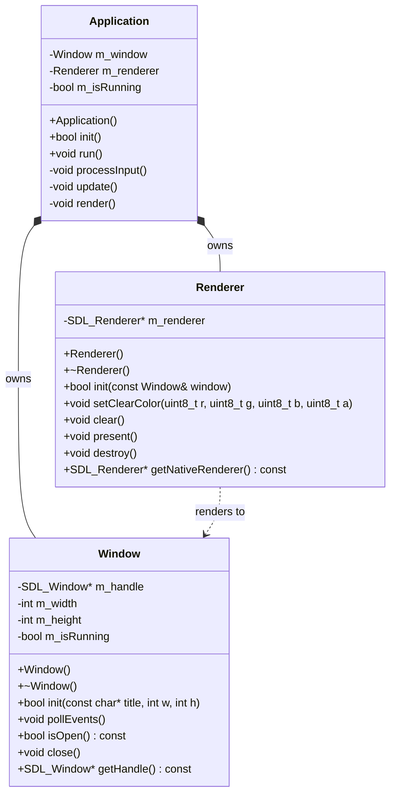

# Engine Architecture

This document describes the core systems of The Void Engine.

## System Components

- **Application**: The entry point and main loop controller. It orchestrates the lifecycle of the Window and Renderer.
- **Window**: Encapsulates the SDL_Window, managing window state (size, title) and OS-level events.
- **Renderer**: Wraps the SDL_Renderer, providing high-level commands for clearing the screen, drawing primitives, and presenting the back buffer.
