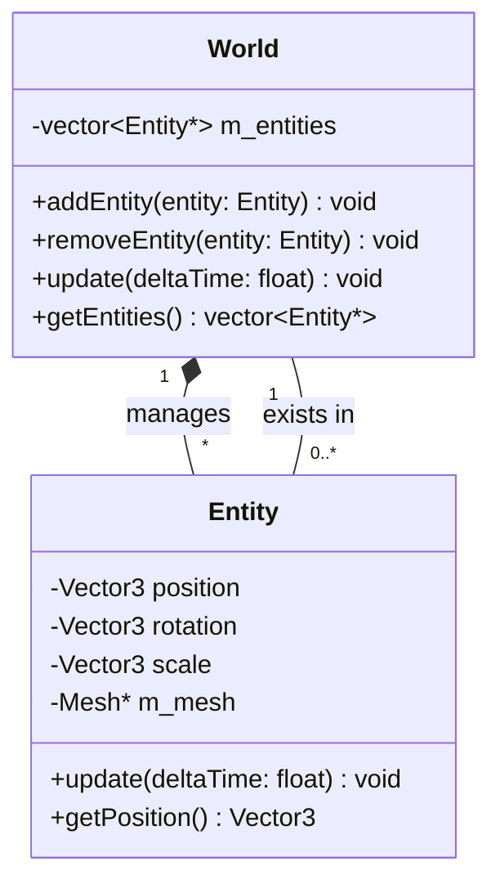

# Game Architecture

This document describes the game-level objects and scene management.

## Scene Management

- **World**: The container for all active game entities. It handles updating logic and provides entities to the renderer.
- **Entity**: The base class for all objects in the game world. Each entity has a transform (position, rotation, scale) and a mesh for rendering.
